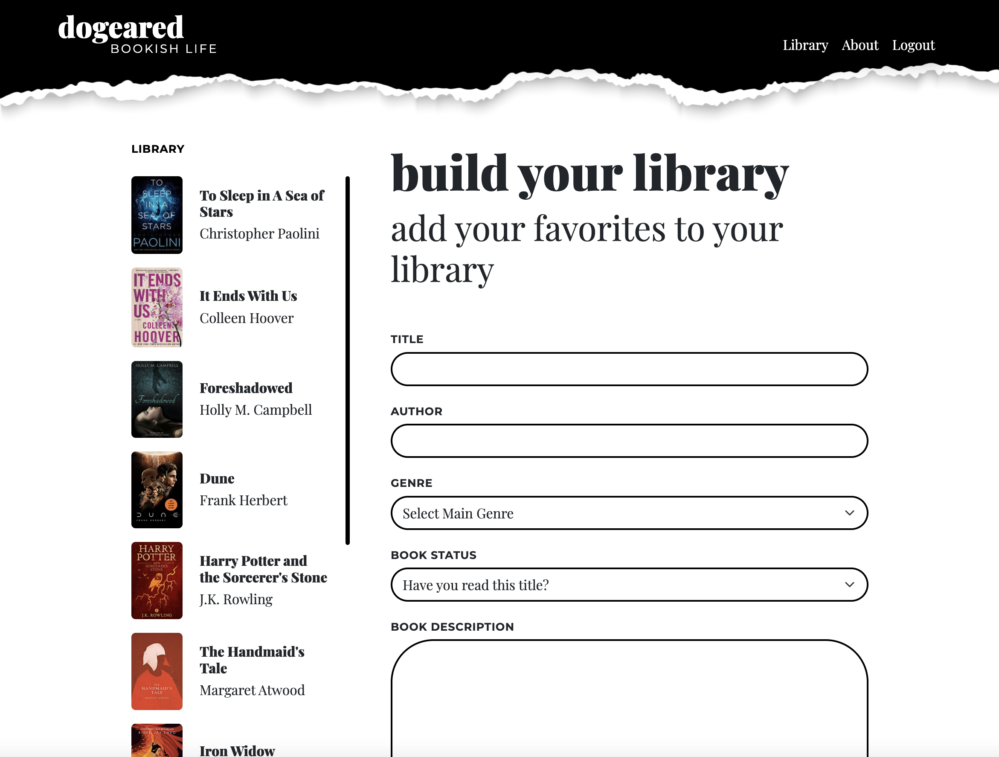

# Dogeared

## Description

This application was created as a space for readers to build a personal, digital library. It is a tool that can be used to organize books into "Have Read" and "Want to Read" lists. Books may be added, modified, and deleted. The user can attach notes and favorite quotes to the books in their library. Dogeared is also a great tool for book reviewers who want one place to write, edit, and save reviews.

## User Story
```
AS an avid reader
I WANT to be able to build a personal digital library 
SO THAT I can keep track of books that I want to read 
       and have read

AS an avid reader
I WANT to be able to save notes to the books I’ve read
SO THAT I can remember my favorite quotes and passages

AS a book reviewer
I WANT a space to write, edit, and save my book reviews
SO THAT I can easily find a specific book review, then
        copy and post it onto several review sites
```

## Technologies Used

    * HTML
    * CSS
    * Javascript
    * Node.js
    * Express.js
    * Busboy
    * Multer
    * Heroku

## URL for Heroku deployment

https://dogeared-2022.herokuapp.com/login

## URL for GitHub Repo

https://github.com/jsamborski310/dogeared

## Collaborators

    * Juanita Samborski
        https://github.com/jsamborski310
   
    * Mohamed Mohamud
        https://github.com/mozini206
   
    * Christina Bohn
        https://github.com/ChristinaBohn


## Dogeared Preview


