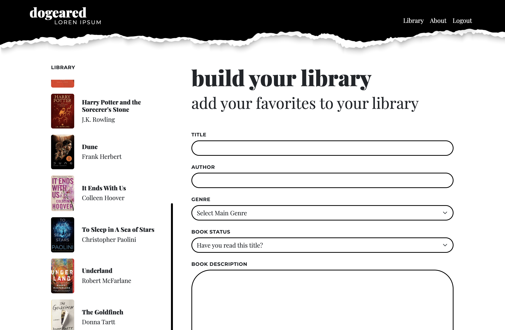

# Dogeared

## Description

This application is a personal digital library for anyone who loves to read! 

## Technologies Used

    * Javascript
    * Node.js
    * Express.js
    * Busboy
    * Heroku

## What We Learned

## URL for Heroku deployment

## URL for GitHub Repo

https://github.com/jsamborski310/dogeared

## Collaborators

    * Juanita Samborski
        - https://github.com/jsamborski310
        - https://www.linkedin.com/in/juanita-samborski/
   
    * Mohamed Mohamud
        - https://github.com/mozini206
   
    * Christina Bohn
        - https://github.com/ChristinaBohn
        - https://www.linkedin.com/in/christina-bohn-7a1294124/

## On Task Note Taker Preview

